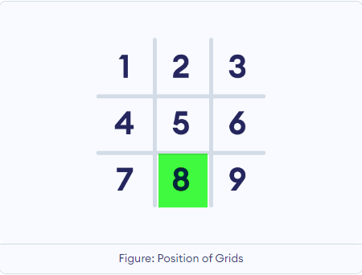

## Project Introduction - paper-game-tic-tac-toe.
In this project, we will create the paper game tic-tac-toe using a class object-based approach.  

---
## Game Description
For those unfamiliar with the game, here's how it works:

Two players alternate turns attempting to complete a row, column, or diagonal using three O's or three X's in a grid of nine squares.

Game rules are:
* If a player decides to select X, the other player will take O. Players take turns putting their marks in empty squares.
* The first player to get 3 of their marks in a straight row wins.
* If all the 9 squares are full but none of the players can get 3 of their marks in a row, it's a draw.

---
## Project Description
Here's how our project works:

### Project Design

The game design be divided into three main categories:  

1- The tic-tac-toe Board  
2- Two Players  
3- Win and Draw Logic  

#### The tic-tac-toe Board

We will handle this task by using a list of 9 items, since a tic-tac-toe board contains 9 squares.  
Grids are identified by their position numbers.  As an example, position 8 refers to the bottom middle grid.  

 

---
## Usage
If you would like to run this project code, you can use one of the following online IDEs with Python 3 support:  
* [programiz](https://www.programiz.com/python-programming/online-compiler/)
* https://pynative.com/

Press the 'Run' button to execute the code provided in this project.  
Your browser will display the game interaction and results.

---
### Contributors
Brought to you by Carlos R. you may reach me at carlosraymundo@gmail.com

---
### License
MIT.
